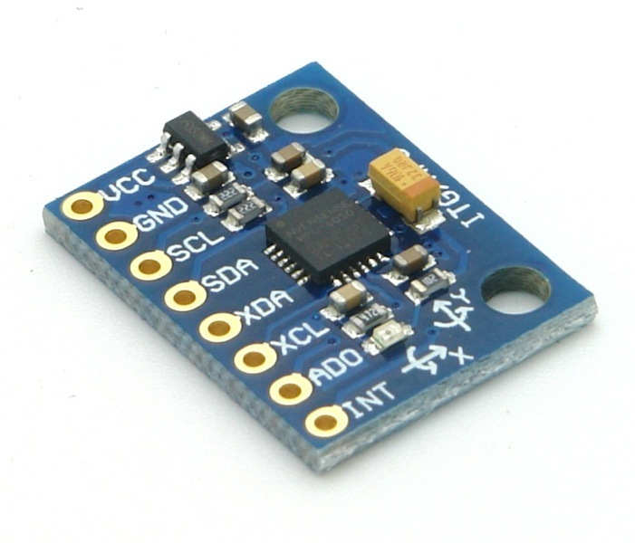

# Mizuna Robot – Materials Required

This document lists all the hardware components needed to assemble the Mizuna AI Companion Robot. Each item is illustrated in the `assets` folder.

---

## Core Components

| Component                | Image                                      | Description / Purpose                                   |
|--------------------------|--------------------------------------------|---------------------------------------------------------|
| **NodeMCU x2**           |              | Microcontroller for motor/sensor control and comms      |
| **NodeMCU Motor Shield** |    | Drives motors via NodeMCU                               |
| **Raspberry Pi 3/4/5**   |    | Main computer for AI, camera, and app server            |
| **Raspberry Pi Camera**  |                | Provides live video streaming and vision                |
| **Bluetooth/Custom Speaker** |          | Outputs synthesized speech and audio feedback           |
| **BO Motors + Wheels x4**|    | Enable movement and navigation                          |
| **OLED Screen 1.3 inch** |                    | Shows status, face, or debug info (optional)            |
| **MPU 6050**             |              | Orientation and motion sensor (optional)                |
| **12V Battery Pack**     |              | Main power source for robot and peripherals             |
| **Power Supply Module**  |    | Regulates voltage for Pi, motors, and LEDs              |
| **Micro USB Mic**        |                      | Captures voice commands                                 |
| **LED Matrix**           |         | Expressive RGB feedback and animations                  |
| **Breadboard**           |         | Prototyping and connecting components                   |
| **Jumper Wires**         |     | For making electrical connections between modules       |

---

## Additional Notes

- **Wiring:** Use quality jumper wires and ensure all grounds are connected.
- **Power:** Use a high-current 5V supply for the Pi and LEDs. Motors may require a separate supply.
- **Sensors:** You can expand with more sensors (PIR, temperature, etc.) as needed.
- **Enclosure:** 3D-printed or custom chassis recommended for protection and aesthetics.

---

## Visual Reference

All images are available in the [`assets`](assets) directory for documentation or presentation use.